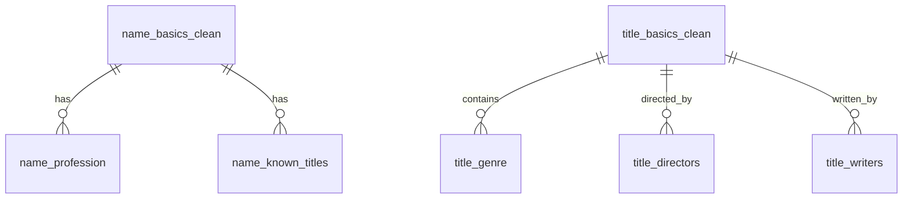

# 🎬 IMDb Database Project

This project demonstrates how to import, normalize, and visualize the non-commercial IMDb dataset using **MySQL** and **Mermaid.js**.

---

## 📁 Project Structure


```text
imdb-project/
├── img/
│   └── er_diagram.png
├── README.md                  ← This file
│
├── schema/
│   ├── imdb_schema.sql        ← All-in-one script: raw schema, loading, normalization
│   └── imdb_er_diagram.er     ← Mermaid.js ER diagram definition
│
├── data/
│   └── .gitignore             ← Keeps folder in repo; for large .tsv IMDb files (excluded)

```

---

## 📥 Step 1: Download the IMDb Dataset

Download the free non-commercial IMDb dataset from the official portal:  
🔗 [IMDb Non-Commercial Datasets](https://datasets.imdbws.com/)

---

## 📂 Step 2: Extract the Dataset Files

The files are in `.tsv.gz` format. Use tools like:

- [7-Zip](https://www.7-zip.org/)
- WinRAR
- `gzip` (Linux/macOS CLI)

...to extract them into `.tsv` (tab-separated values) format.

---

## 📁 Step 3: Move Files to MySQL Upload Directory

To avoid file permission issues with `LOAD DATA INFILE`, move the extracted `.tsv` files to MySQL's secure upload directory:

```text
C:\ProgramData\MySQL\MySQL Server 8.0\upload\
```


💡 You can configure or check this path using the `secure_file_priv` setting in `my.ini` or `my.cnf`.

---

## 🏗️ Step 4: Create the IMDb Database

In your MySQL shell or GUI:

```sql
CREATE DATABASE imdb_db;
USE imdb_db;
```

## 📥 Step 5: Run the IMDb Schema Script

Run this script to create raw tables, load data, and normalize the schema:

```sql
SOURCE schema/imdb_schema.sql;
```

Repeat for other IMDb files like:

title.basics.tsv → title_basics

title.crew.tsv → title_crew

title.principals.tsv → title_principals

etc.

## 🧹 Step 6: Normalize the Schema (BCNF & 4NF)
Break down large raw tables into logical entities. Store this logic in scripts/normalize.sql.

Example Decomposition:

```text
name_basics ➝
name_basics_clean – personal info (excluding professions and known titles)

name_profession – links person to profession(s)

name_known_titles – links person to known titles

title_basics ➝
title_basics_clean – title metadata (excluding genres)

title_genre – maps titles to genres

title_crew ➝
title_crew_clean – general crew info

title_directors – title-to-director mapping

title_writers – title-to-writer mapping

```

## 🧩 Step 7: Match Table Names with ER Diagram

Ensure all normalized table names match the entity names used in your ER diagram for consistency.

## 🖼️ Step 8: Visualize the Schema with Mermaid.js

You can define your entity relationships using Mermaid.js. Save this in schema/imdb_er_diagram.er.

Example Mermaid ER Diagram:



You can preview this using [Mermaid Live Editor](https://mermaid.live/edit) or integrate into a documentation site or markdown viewer that supports Mermaid.

## ✅ Final Tips

Make sure foreign keys are well indexed for joins.

Include primary/foreign key constraints in your imdb_schema.sql.

Document assumptions or exclusions (e.g., nullable columns, dropped fields).

Back up your raw and normalized tables separately for clarity.

## 📚 References

- [IMDb Dataset Info](https://www.imdb.com/interfaces/)
- [Mermaid Documentation](https://mermaid.js.org/)
- [MySQL Secure File Priv Docs](https://dev.mysql.com/doc/refman/8.0/en/server-system-variables.html#sysvar_secure_file_priv)

---

© **License**

This project uses only the non-commercial IMDb dataset. All rights to the data remain with [IMDb](https://www.imdb.com/).


